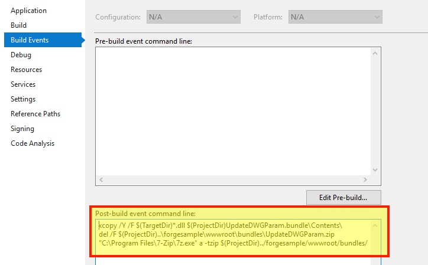

此步骤将帮助您创建用于 Design Automation 的基本 AutoCAD 插件。有关详细信息，请访问 [我的第一个 AutoCAD 插件](https://knowledge.autodesk.com/support/autocad/learn-explore/caas/simplecontent/content/my-first-autocad-plug-overview.html） 教程。

> 您可以 [下载 Bundle ZIP](https://github.com/autodesk-platform-services/aps-design-automation-dotnet/blob/master/designAutomationSample/wwwroot/bundles/UpdateDWGParam.zip） 到 'bundles/' （Node.js） 或 '/designAutomationSample/wwwroot/bundles' （.NET 6） 文件夹和 [跳到 **上传插件包** 部分](#upload-plugin-bundle）。

### 创建一个新项目

- 右键单击解决方案，**添加**>>**新建项目**。
- 选择“Windows 桌面”，然后选择“类库”，最后将其命名为“UpdateDWGParam”。
- 然后右键单击项目，转到“**管理 NuGet 包...**”，在“**浏览器**”下，您可以搜索“**AutoCAD.NET**”并安装“AutoCAD.NET.Core”（也会安装“AutoCAD.NET.Model”）。
- 然后搜索并安装“Newtonsoft.Json”（用于解析 JSON 格式的输入数据）。

> 请选择 .NET Framework 4.8。如果未列出，[请安装开发包](https://dotnet.microsoft.com/download/dotnet-framework/net48）。


因此，**package.config** 应如下所示。此示例使用版本 20，该版本应适用于所有可用版本。您可以调整到特定版本。

项目应该包含一个“Class1.cs”类，让我们将文件重命名为“Commands.cs”（为了保持一致性）。

```cs title=Commands.cs
using Autodesk.AutoCAD.ApplicationServices.Core;
using Autodesk.AutoCAD.DatabaseServices;
using Autodesk.AutoCAD.Runtime;
using Newtonsoft.Json;
using System.IO;
[assembly: CommandClass(typeof(UpdateDWGParam.Commands))]
[assembly: ExtensionApplication(null)]
namespace UpdateDWGParam
{
    public class Commands
    {
        [CommandMethod("UpdateParam", CommandFlags.Modal)]
        public static void UpdateParam()
        {
            //Get active document of drawing with Dynamic block
            var doc = Application.DocumentManager.MdiActiveDocument;
            var db = doc.Database;
            // read input parameters from JSON file
            InputParams inputParams = JsonConvert.DeserializeObject<InputParams>(File.ReadAllText("params.json"));
            using (Transaction t = db.TransactionManager.StartTransaction())
            {
                var bt = t.GetObject(db.BlockTableId, OpenMode.ForRead) as BlockTable;
                foreach (ObjectId btrId in bt)
                {
                    //get the blockDef and check if is anonymous
                    BlockTableRecord btr = (BlockTableRecord)t.GetObject(btrId, OpenMode.ForRead);
                    if (btr.IsDynamicBlock)
                    {
                        //get all anonymous blocks from this dynamic block
                        ObjectIdCollection anonymousIds = btr.GetAnonymousBlockIds();
                        ObjectIdCollection dynBlockRefs = new ObjectIdCollection();
                        foreach (ObjectId anonymousBtrId in anonymousIds)
                        {
                            //get the anonymous block
                            BlockTableRecord anonymousBtr = (BlockTableRecord)t.GetObject(anonymousBtrId, OpenMode.ForRead);
                            //and all references to this block
                            ObjectIdCollection blockRefIds = anonymousBtr.GetBlockReferenceIds(true, true);
                            foreach (ObjectId id in blockRefIds)
                            {
                                dynBlockRefs.Add(id);
                            }
                        }
                        if (dynBlockRefs.Count > 0)
                        {
                            //Get the first dynamic block reference, we have only one Dyanmic Block reference in Drawing
                            var dBref = t.GetObject(dynBlockRefs[0], OpenMode.ForWrite) as BlockReference;
                            UpdateDynamicProperties(dBref, inputParams);
                        }
                    }
                }
                t.Commit();
            }
            LogTrace("Saving file...");
            db.SaveAs("outputFile.dwg", DwgVersion.Current);
        }
        /// <summary>
        /// This updates the Dyanmic Blockreference with given Width and Height
        /// The initial parameters of Dynamic Blockrefence, Width =20.00 and Height =40.00
        /// </summary>
        /// <param Editor="ed"></param>
        /// <param BlockReference="br"></param>
        /// <param String="name"></param>
        private static void UpdateDynamicProperties(BlockReference br, InputParams inputParams)
        {
            // Only continue is we have a valid dynamic block
            if (br != null && br.IsDynamicBlock)
            {
                // Get the dynamic block's property collection
                DynamicBlockReferencePropertyCollection pc = br.DynamicBlockReferencePropertyCollection;
                foreach (DynamicBlockReferenceProperty prop in pc)
                {
                    switch (prop.PropertyName)
                    {
                        case "Width":
                            prop.Value = inputParams.Width;
                            break;
                        case "Height":
                            prop.Value = inputParams.Height;
                            break;
                        default:
                            break;
                    }
                }
            }
        }
        /// <summary>
        /// This will appear on the Design Automation output
        /// </summary>
        private static void LogTrace(string format, params object[] args) { Application.DocumentManager.MdiActiveDocument.Editor.WriteMessage(format, args); }
    }
    public class InputParams
    {
        public double Width { get; set; }
        public double Height { get; set; }
    }
}
```

这是将与AutoCAD一起运行的主代码。将以下内容复制到“Commands.cs”中。该类包含一个自定义 AutoCAD 命令“UpdateParam”，该命令定义为具有相同名称的方法。此命令由设计自动化引擎调用，将在 **Activity**（本教程的下一步）中指定

```xml title=PackageContents.xml
<?xml version="1.0" encoding="utf-8" ?>
<ApplicationPackage SchemaVersion="1.0" Version="1.0" ProductCode="{F11EA57A-1E7E-4B6D-8E81-986B071E3E07}" Name="AutoCADDesignAutomation" Description="Sample Plugin for AutoCAD" Author="tutorials.autodesk.io>">
  <CompanyDetails Name="Autodesk, Inc" Url="http://tutorials.autodesk.io" Email="forge.help@autodesk.com"/>
  <Components>
    <RuntimeRequirements OS="Win64" Platform="AutoCAD"/>
    <ComponentEntry AppName="UpdateWindowParameters" ModuleName="./Contents/UpdateDWGParam.dll" AppDescription="AutoCAD .NET App to update parameters of Dynamic blockreference in AutoCAD Drawing" LoadOnCommandInvocation="True" LoadOnAutoCADStartup="True">
      <Commands GroupName="FPDCommands">
        <Command Global="UpdateParam" Local="UpdateParam"/>
      </Commands>
    </ComponentEntry>
  </Components>
</ApplicationPackage>
```

创建一个名为“UpdateDWGParam.bundle”的文件夹，并在其中创建一个名为“PackageContents.xml”的文件，然后将以下内容复制到其中。有关详细信息，请参阅 [PackageContents.xml 格式参考](https://help.autodesk.com/view/ACD/2023/ENU/?guid=GUID-BC76355D-682B-46ED-B9B7-66C95EEF2BD0）。此文件定义了新的AutoCAD自定义命令“UpdateParam”，该命令将在执行Design Automation时调用。

最后，创建一个名为“Contents”的子文件夹并将其留空。此时，项目应如下所示：

## 构建后事件

> 对于Node.js，需要调整 AppBundle ZIP 输出文件夹。

现在我们需要压缩 .bundle 文件夹。右键单击项目，选择“**属性**”，然后打开“**生成事件**”，并将以下内容复制到“**生成后事件命令行**”字段中，如下图所示。

```bash
xcopy /Y /F "$(TargetDir)*.dll" "$(ProjectDir)UpdateDWGParam.bundle\Contents\"
del /F "$(ProjectDir)..\designAutomationSample\wwwroot\bundles\UpdateDWGParam.zip"
"C:\Program Files\7-Zip\7z.exe" a -tzip "$(ProjectDir)../designAutomationSample/wwwroot/bundles/UpdateDWGParam.zip" "$(ProjectDir)UpdateDWGParam.bundle\" -xr0!*.pdb
```

This will copy the DLL from `/bin/debug/` into `.bundle/Contents` folder, then use [7zip](https://www.7-zip.org/) to create a zip, then finally copy the ZIP into `/bundles` folders of the webapp.


> 请注意 **生成后事件** 如何使用项目和文件夹名称，因此请确保使用此名称。

如果现在生成“UpdateDWGParam”项目，则应该在“输出”窗口中看到类似这样的内容。请注意压缩的 2 个文件夹和 3 个文件。zip 文件直接在“/wwwroot/bundles”文件夹中创建。这意味着你做得很好！


