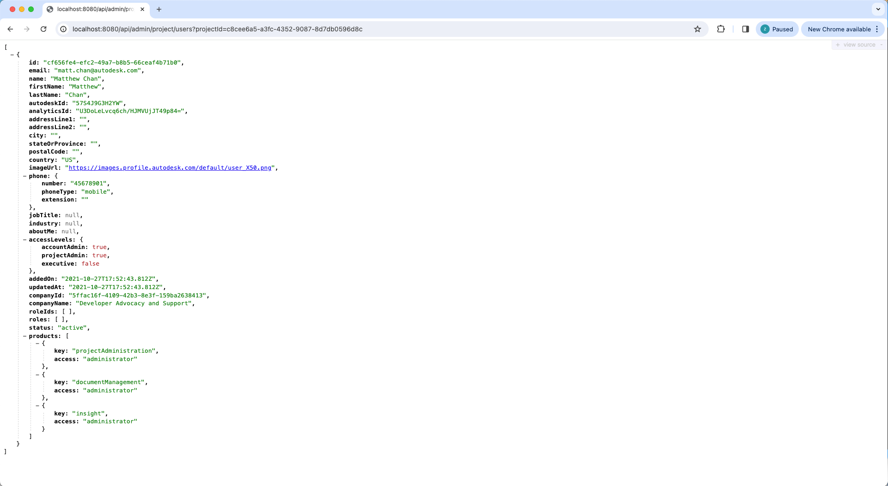

import NodeJsVsCodeHubs from './_shared/nodejs-vscode/admin/account-admin.mdx';
import NodeJsVsCodeEndpoints from './_shared/nodejs-vscode/admin/endpoints.mdx';

# 账号管理员

现在，是时候实现我们的服务器以支持帐户管理员访问了，在此步骤中，我们将
继续根据 [帐户管理 API](https://aps.autodesk.com/en/docs/acc/v1/overview/field-guide/admin/） 扩展我们的服务器
获取和创建 ACC 项目和用户的数据：

## 项目和用户

First, let's add a couple of helper methods for getting and importing projects and users:

<NodeJsVsCodeHubs />

## 服务器端点

接下来，让我们通过另一个将新功能公开给客户端代码
终结点集。

<NodeJsVsCodeEndpoints />

## 试一试

服务器端就是这样。是时候尝试一下了！

像往常一样从 Visual Studio Code 启动（或重启）应用，
- 使用上一步中获取的一个 ACC 中心的 ID（删除 **b.**）：http://localhost:8080/api/admin/projects?accountId={your-account-id}。
在这种情况下，服务器应用程序应使用所有项目的 JSON 列表进行响应
在指定的中心下可用。
- 使用上一步中获取的项目 ID，尝试调用该地址：
http://localhost:8080/api/admin/project/users?projectId={your-project-id}，服务器应用程序应
使用此项目中所有用户的 JSON 列表进行响应。

:::info

您可能会通过 2 个不同的端点获得不同的项目列表，以下是说明：
- 使用数据管理 API，它将返回当前用户参与的所有项目。
- 使用 Account Admin API，如果当前用户是 Account Admin，它将返回 Account 中的所有项目。

:::

