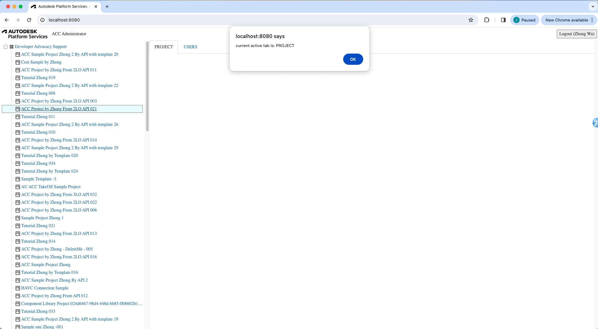

import NodeJsVsCodeStructure from './_shared/nodejs-vscode/final-folder-structure.mdx';

# UI框架

好的，我们现在将构建应用程序的客户端部分。

## 表格占位符

我们先从实现 Table 的占位符函数开始，
使用以下代码在“wwwroot”子文件夹下创建一个“table.js”文件：

```js title="wwwroot/table.js"
const TABLE_TABS = {
    'PROJECTS': {
        'REQUEST_URL': '/api/admin/projects',
        'TAB_NAME': 'PROJECTS',
        'CATEGORY_NAME': 'hub',
        'CATEGORY_DEFAULT': true
    },
    'PROJECT': {
        'REQUEST_URL': '/api/admin/project',
        'TAB_NAME': 'PROJECT',
        'CATEGORY_NAME': 'project',
        'CATEGORY_DEFAULT': true
    },
    'USERS': {
        'REQUEST_URL': '/api/admin/project/users',
        'TAB_NAME': 'USERS',
        'CATEGORY_NAME': 'project',
        'CATEGORY_DEFAULT': false
    }
}
//////////////////////////////////////////////////////////////////////////////////////////////////////////
//Table class wraps the specific data info
class Table {
    #tableId;
    #accountId;
    #projectId;
    #tabKey;
    #dataSet;
    #maxItem;
    constructor(tableId, accountId = null, projectId = null, tabKey = 'PROJECTS') {
        this.#tableId = tableId;
        this.#accountId = accountId;
        this.#projectId = projectId;
        this.#tabKey = tabKey;
        this.#dataSet = null;
        this.#maxItem = 5;
    };
    get tabKey(){
        return this.#tabKey;
    }
    set tabKey( tabKey){
        this.#tabKey = tabKey;
    }
    resetData = async( tabKey=null, accountId=null, projectId=null ) =>{
        //TBD
    }
    drawTable = () => {
        //TBD
    }
    exportToCSV = ()=>{
        //TBD
    }
    importFromCSV = async() => {
        //TBD
    }    
}

export async function refreshTable( accountId = null, projectId=null ) {
    $("#loadingoverlay").fadeIn()
    if( TABLE_TABS[g_accDataTable.tabKey].CATEGORY_NAME=='hub' && projectId ){
        for (let key in TABLE_TABS) {
            if( TABLE_TABS[key].CATEGORY_NAME == 'hub' ){
                $("#" + key).addClass("hidden");
                $("#" + key).removeClass("active");
            }
            else{
                if( TABLE_TABS[key].CATEGORY_DEFAULT )
                    $("#" + key).addClass("active");
                $("#" + key).removeClass("hidden");
            }
        } 
    }
    if (TABLE_TABS[g_accDataTable.tabKey].CATEGORY_NAME == 'project' && !projectId) {
        for (let key in TABLE_TABS) {
            if (TABLE_TABS[key].CATEGORY_NAME == 'hub') {
                $("#" + key).removeClass("hidden");
                if (TABLE_TABS[key].CATEGORY_DEFAULT)
                    $("#" + key).addClass("active");
            }
            else {
                $("#" + key).addClass("hidden");
                $("#" + key).removeClass("active");
            }
        }
    }
    const activeTab = $("ul#adminTableTabs li.active")[0].id;
    g_accDataTable.tabKey = activeTab;
    alert( "current active tab is: " + activeTab );
    $("#loadingoverlay").fadeOut()
}
export async function initTableTabs(){
    // add all tabs
    for (let key in TABLE_TABS) {
        $('<li id=' + key + '><a href="accTable" data-toggle="tab">' + TABLE_TABS[key].TAB_NAME + '</a></li>').appendTo('#adminTableTabs');
        $("#" + key).addClass((TABLE_TABS[key].CATEGORY_NAME == 'hub' && TABLE_TABS[key].CATEGORY_DEFAULT) ? "active" : "hidden");
    } 
    // event on the tabs
    $('a[data-toggle="tab"]').on('shown.bs.tab', async function (e) {
        $("#loadingoverlay").fadeIn()
        const activeTab = e.target.parentElement.id;
        g_accDataTable.tabKey = activeTab;
        alert( "current active tab is: " + activeTab );
        $("#loadingoverlay").fadeOut()
    }); 
}
var g_accDataTable = new Table('#accTable' );
```

脚本是 [ES6 模块](https://developer.mozilla.org/en-US/docs/Web/JavaScript/Guide/Modules）
定义一个类“Table”，用于列出项目和用户的信息，该模块还
导出两个函数：

- 'initTableTabs' 将创建选项卡，并在更改活动选项卡时注册函数。
- 'refreshTable'用于将所选中心/项目的数据加载到表中。

## 侧边栏逻辑

接下来，我们将实现侧边栏的行为，我们将在其中显示
第三方树视图组件中的所有 ACC 中心和项目。
使用以下代码在“wwwroot”子文件夹下创建一个“sidebar.js”文件：

```js title="wwwroot/sidebar.js"
async function getJSON(url) {
    const resp = await fetch(url);
    if (!resp.ok) {
        alert('Could not load tree data. See console for more details.');
        console.error(await resp.text());
        return [];
    }
    return resp.json();
}
function createTreeNode(id, text, icon, children = false) {
    return { id, text, children, itree: { icon } };
}
async function getHubs() {
    const hubs = await getJSON('/api/hubs');
    return hubs.map(hub => createTreeNode(`hub|${hub.id}`, hub.attributes.name, 'icon-hub', true));
}
async function getProjects(hubId) {
    const projects = await getJSON(`/api/hubs/${hubId}/projects`);
    return projects.map(project => createTreeNode(`project|${hubId}|${project.id}`, project.attributes.name, 'icon-project', false));
}

export function initTree(selector, onSelectionChanged) {
    // See http://inspire-tree.com
    const tree = new InspireTree({
        data: function (node) {
            if (!node || !node.id) {
                return getHubs();
            } else {
                const tokens = node.id.split('|');
                switch (tokens[0]) {
                    case 'hub': return getProjects(tokens[1]);
                    default: return [];
                }
            }
        }
    });
    tree.on('node.click', function (event, node) {
        event.preventTreeDefault();
        const tokens = node.id.split('|');
        if (tokens[0] === 'hub') {
            onSelectionChanged( tokens[1], null);
        }
        if (tokens[0] === 'project') {
            onSelectionChanged( tokens[1], tokens[2]);
        }
    });
    return new InspireTreeDOM(tree, { target: selector });
}
```

## 应用逻辑

现在，让我们将所有 UI 组件连接在一起。在下创建一个“main.js”文件
“wwwroot”文件夹，并使用以下代码填充它：

```js title="wwwroot/main.js"
import { refreshTable, initTableTabs } from './table.js';
import { initTree } from './sidebar.js';
const login = document.getElementById('login');
try {
    const resp = await fetch('/api/auth/profile');
    if (resp.ok) {
        const user = await resp.json();
        login.innerText = `Logout (${user.name})`;
        login.onclick = () => {
            const iframe = document.createElement('iframe');
            iframe.style.visibility = 'hidden';
            iframe.src = 'https://accounts.autodesk.com/Authentication/LogOut';
            document.body.appendChild(iframe);
            iframe.onload = () => {
                window.location.replace('/api/auth/logout');
                document.body.removeChild(iframe);
            };
        }
        initTree('#tree', (accountId, projectId) => refreshTable(accountId, projectId));
        await initTableTabs();
    } else {
        login.innerText = 'Login';
        login.onclick = () => window.location.replace('/api/auth/login');
    }
    login.style.visibility = 'visible';
} catch (err) {
    alert('Could not initialize the application. See console for more details.');
    console.error(err);
}
```

该脚本将首先尝试获取用户详细信息，以检查我们是否已登录。
如果是这样，代码就可以初始化表以及树视图组件。
传递给“initTree”的回调函数确保当我们单击叶节点时
在树中，表将开始加载相应的数据。

## 用户界面

最后，让我们构建应用程序的 UI。

在“wwwroot”子文件夹下创建一个“main.css”文件，并使用以下 CSS 规则填充它：

```css title="wwwroot/main.css"
body, html {
    margin: 0;
    padding: 0;
    height: 100vh;
    font-family: ArtifaktElement;
}
#header, #sidebar, #table, #loadingoverlay {
    position: absolute;
}
#header {
    height: 3em;
    width: 100%;
    display: flex;
    flex-flow: row nowrap;
    justify-content: space-between;
    align-items: center;
}
#sidebar {
    width: 25%;
    left: 0;
    top: 3em;
    bottom: 0;
    overflow-y: scroll;
}
#table {
    width: 75%;
    right: 0;
    top: 3em;
    bottom: 0;
    overflow-y: scroll;
}
#loadingoverlay{
    top: 3em;
    z-index: 90;
    width: 100%;
    height: 100%;
    display: none;
    background: rgba(0, 0, 0, 0.6);
}
.cv-spinner {
    height: 100%;
    display: flex;
    justify-content: center;
    align-items: center;
}
.spinner {
    width: 60px;
    height: 60px;
    border: 6px #ddd solid;
    border-top: 6px #2e93e6 solid;
    border-radius: 50%;
    animation: sp-anime 0.8s infinite linear;
}
@keyframes sp-anime {
    0% {
        transform: rotate(0deg);
    }
    100% {
        transform: rotate(359deg);
    }
}
#header > * {
    height: 2em;
    margin: 0 0.5em;
}
#login {
    font-family: ArtifaktElement;
    font-size: 1em;
}
#header .title {
    height: auto;
    margin-right: auto;
}
#tree {
    margin: 0.5em;
}
#workingAnimation {    
    text-align: center;
}
@media (max-width: 768px) {
    #sidebar {
        width: 100%;
        top: 3em;
        bottom: 75%;
    }
    #table {
        width: 100%;
        top: 25%;
        bottom: 0;
    }
}
.icon-hub:before {
    background-image: url(https://raw.githubusercontent.com/primer/octicons/main/icons/apps-16.svg); /* or https://raw.githubusercontent.com/primer/octicons/main/icons/stack-16.svg */
    background-size: cover;
}
.icon-project:before {
    
    background-image: url(https://raw.githubusercontent.com/primer/octicons/main/icons/project-16.svg); /* or https://raw.githubusercontent.com/primer/octicons/main/icons/organization-16.svg */
    background-size: cover;
}
```

然后，在同一文件夹中创建一个包含以下内容的“index.html”文件：

```html title="wwwroot/index.html"
<!doctype html>
<html lang="en">
<head>
    <meta charset="utf-8">
    <meta name="viewport" content="width=device-width, initial-scale=1">
    <link rel="icon" type="image/x-icon" href="https://cdn.autodesk.io/favicon.ico">
    <link rel="stylesheet" href="https://unpkg.com/inspire-tree-dom@4.0.6/dist/inspire-tree-light.min.css">
    <link rel="stylesheet" href="https://maxcdn.bootstrapcdn.com/bootstrap/3.4.1/css/bootstrap.min.css">
    <link rel="stylesheet" href="https://unpkg.com/bootstrap-table@1.22.2/dist/bootstrap-table.min.css">
    <link rel="stylesheet" href="/main.css">
    <script src="//cdnjs.cloudflare.com/ajax/libs/jquery/3.3.1/jquery.min.js"></script>
    <script src="https://cdnjs.cloudflare.com/ajax/libs/lodash.js/4.17.21/lodash.min.js"></script>
    <script src="https://unpkg.com/inspire-tree@4.3.1/dist/inspire-tree.js"></script>
    <script src="https://unpkg.com/inspire-tree-dom@4.0.6/dist/inspire-tree-dom.min.js"></script>
    <script src="https://maxcdn.bootstrapcdn.com/bootstrap/3.4.1/js/bootstrap.min.js"></script>
    <script src="https://unpkg.com/bootstrap-table@1.22.2/dist/bootstrap-table.min.js"></script>
    <script src="https://rawgit.com/michaelsogos/bootstrap-table-toolbar-buttons/master/src/bootstrap-table-toolbar-buttons.js"></script>
    <script src="https://unpkg.com/axios/dist/axios.min.js"></script>
    <script src="/main.js" type="module"></script>
    <title>Autodesk Platform Services: ACC Administrator</title>
</head>
<body>
    <div id="header">
        
        <span class="title">ACC Administrator</span>
        <button id="login" style="visibility: hidden;">Login</button>
    </div>
    <div id="sidebar">
        <div id="tree"></div>
    </div>
    <div id="table">
        <ul id="adminTableTabs" class="nav nav-tabs">
        </ul>
        <table id="accTable" class="table-striped table-bordered table-hover">
        </table>
        <div id="loadingoverlay">
            <div class="cv-spinner">
                <span class="spinner"></span>
            </div>
        </div>
    </div>
</body>
</html>
```

> Note that since `main.js` is also an ES6 module, we have to use `type="module"` in its `<script>` tag.

应用程序源代码的最终文件夹结构现在应如下所示：

<NodeJsVsCodeStructure />

## 试一试

应用程序现在已准备好测试框架。像往常一样启动它，当你去
[http://localhost:8080](http://localhost:8080），您应该会看到一个简单的 UI，其中包含
左边是树视图，右边是一张空桌子。尝试浏览树，
在下一步中，我们将把数据加载到表中。



